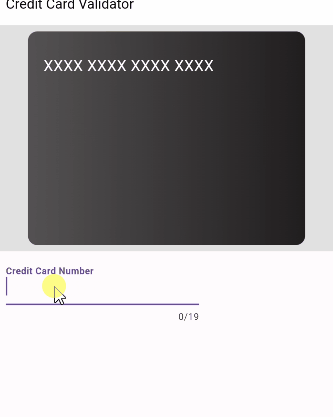

# credit_card_flag_detector | Credit Card Flag Detector

A Dart package that detects credit card types based on the current credit card number patterns

This package is inspired by [Credit Card Validator - Cholojuanito GitHub](https://github.com/cholojuanito/credit_card_validator)



## Installing

Add dependency to your `pubspec.yaml`

*Get the current version in the **Installing** tab on pub.dartlang.org*

```yaml
dependencies:
    credit_card_flag_detector: <current_version>
```

## Usage

```dart
import 'package:credit_card_flag_detector/credit_card_flag_detector.dart';

String visaStr = '4647 7200 6779 1032';

var types = CreditCardFlagDetector.detectCCType(visaStr);

assert(types.contains(CreditCardFlag.visa.creditCardFlag))
```

**Check out the example app** in the [example](example) directory or the 'Example' tab on pub.dartlang.org for a more complete example using the BLoC pattern

## Features

* No external dependencies
* Supported card types:
    * Create your own card types!
    * Default card types:
        * Visa
        * Mastercard
        * American Express
        * Discover
        * Diners Club
        * JCB
        * Union Pay
        * Maestro
        * Mir
        * Elo
        * Hiper/Hipercard

### Pattern Detection

Each card type has a corresponding list of patterns. See the `cardNumPatterns` map.
Each pattern is an array of strings that represents a range of numbers or a single number. These numbers correspond to the [Issuer Identification number (IIN)](https://en.wikipedia.org/wiki/Payment_card_number) for the credit card company.

There are two types of patterns:

1. Single number pattern. The pattern number is compared against the card number. Partial matches for card numbers that are shorter than the pattern will count as matches (this is helpful for reactive text boxes where the UI can be updated as the user is typing).

    I.e. given the pattern `'123'`, then the card numbers `'1'`, `'12'`, `'123'`, `'1234'` will all match, but `'2'`, `'13'`, and `'124'` will not match.

2. Range of numbers. The card number is checked to be within the range of those numbers in the pattern. Again, partial matches are looked for.

    I.e. given the range `['100', '123']`, then the card numbers `'1'`, `'10'`, `'100'`, `'12'`, `'120'`, `'123'` will all match, but `'2'`, `'13'`, and `'124'` will not match.

Every card type and all of its corresponding patterns are looped over when the function `detectCCType` is called. Whitespace is ignored in the string passed in.
